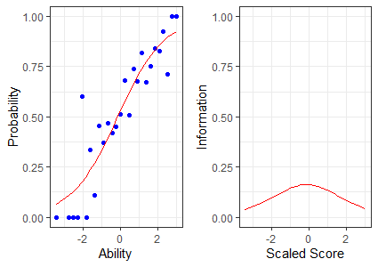
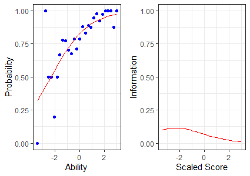
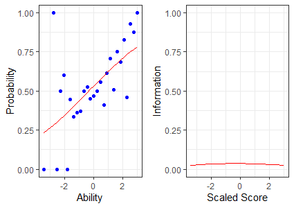
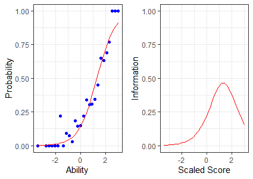

# IRT-in-R

#### ICC and IIC (2P Model)
* Q2244819 (a = 0.808, b = -0.134)
<!-- -->

* Q2318540 (a = 0.680, b = -2.307)
<!-- -->

* Q2268955 (a = 0.384, b = -0.323)
<!-- -->

* Q2248064 (a = 1.367, b = 1.306)
<!-- -->
